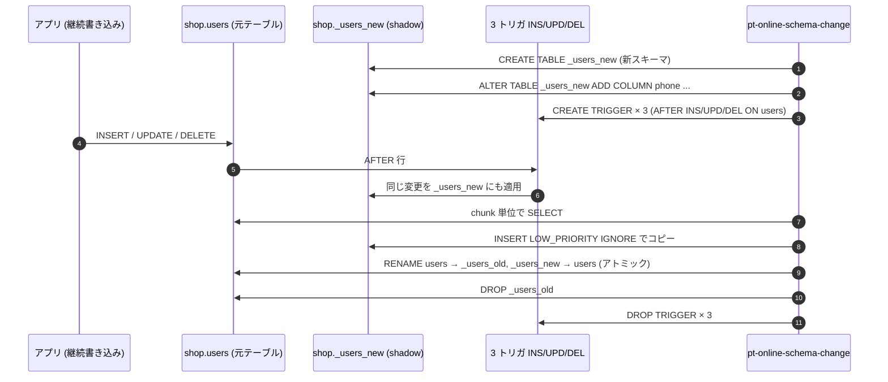

# percona-toolkit-sample


`pt-table-checksum` / `pt-table-sync` / `pt-online-schema-change` / `pt-query-digest` の 4 ツールを Docker Compose で実演するサンプル。Percona Server 8.0 の source / replica と Percona Toolkit コンテナを 3 本立てて、レプリ構築 → 差分注入 → 検出 → 修復 → 無停止 ALTER → スロークエリ集計 をスクリプト一発で再現する。

## これは何か

MySQL の運用ツールである **Percona Toolkit** を一通り手で動かして挙動を理解するための最小環境。pt-table-sync の `--sync-to-source` のように **「STATEMENT-based replication が前提」「source 側で実行して binlog で replica に伝播」** という独特の安全設計が、生きた replica 構成で実際にどう振る舞うかをコードベースで残す。

実証している要素:

| 要素 | 役割 |
|------|------|
| Percona Server 8.0 (source / replica) | binlog レプリケーションを張った 2 ノード構成 |
| `perconalab/percona-toolkit:3.7.1` イメージ | `pt-*` コマンドが入った別コンテナ。DB と同居しない構成にしている |
| `pt-table-checksum` | チャンク単位の MD5 で source と replica の差分を検出 |
| `pt-table-sync` | 検出した差分を `--sync-to-source` で source 経由に修復 |
| `pt-online-schema-change` | shadow テーブル + 3 トリガで無停止 ALTER |
| `pt-query-digest` | `long_query_time=0` の slowlog から TOP クエリ集計 |

## 構成

```
                                 binlog (STATEMENT)
        ┌──────────────┐ ─────────────────────────▶ ┌──────────────┐
        │ pt-source    │                            │ pt-replica   │
        │ Percona 8.0  │                            │ Percona 8.0  │
        │ server-id=1  │                            │ server-id=2  │
        │ port: 13306  │                            │ port: 13307  │
        └──────┬───────┘                            └──────┬───────┘
               │                                           │
               │ ┌──── docker compose exec ──────────────┐ │
               │ │                                       │ │
               └─┤     pt-toolkit  (Perl + pt-* 群)      ├─┘
                 │     entrypoint: sleep infinity        │
                 └───────────────────────────────────────┘
```

- 2 つの Percona Server を `STATEMENT` フォーマットの binlog でレプリ。`pt-table-sync --sync-to-source` が必要とする前提に合わせている
- ツール実行用に **DB と分離した** `perconalab/percona-toolkit:3.7.1` を別コンテナで常駐。「pt-* は DB と同居しない」という運用上の自由度をそのまま再現

## データセット

`init/` の SQL で自動投入される。再帰 CTE で決定的に生成しているので、再現実験のたびに同じ行が並ぶ。

| テーブル | 件数 | 構造 | 検証で使う場面 |
|---------|------|------|----------------|
| `users` | 1,000 | 単一 PK + UNIQUE email | pt-table-sync の Chunk 戦略、pt-online-schema-change の ALTER 対象 |
| `products` | 200 | 単一 PK + UNIQUE sku | UPDATE 1 件で差分 1 チャンクを作る用 |
| `orders` | 3,000 | 単一 PK + index(user_id) | チャンク分割サイズ感の検証 |
| `order_items` | 9,000 | 複合 PK (order_id, product_id) | Nibble アルゴリズム挙動の確認 |
| `access_log` | 5,000 | **主キーなし** | GroupBy / Stream アルゴリズム検証 |

## 必要なもの

- **Docker** (Docker Desktop 等)
- bash (macOS / Linux / WSL)

依存はこれだけ。Percona Toolkit を手元にインストールする必要はない。

## 使い方

```sh
# 1. 起動 + 初期データ投入 (init SQL は自動実行)
docker compose up -d

# 2. ダンプベースで replica の初期コピー + CHANGE REPLICATION SOURCE TO
bash scripts/00-setup-replication.sh

# 3. pt-table-checksum ベースライン (差分ゼロ確認)
bash scripts/10-checksum-clean.sh

# 4. replica にだけ差分を注入
bash scripts/20-introduce-drift.sh

# 5. pt-table-checksum 再走 + 差分チャンク表示
bash scripts/30-detect-diff.sh

# 6. pt-table-sync --print で修復 SQL を目視確認
bash scripts/40-sync-print.sh

# 7. pt-table-sync --execute で修復
bash scripts/50-sync-execute.sh

# 8. pt-online-schema-change で無停止 ALTER (phone カラム追加)
bash scripts/60-osc.sh

# 9. pt-query-digest で slowlog 集計
bash scripts/70-query-digest.sh
```

## スクリプトの中身

| ファイル | 何をする |
|---------|---------|
| `00-setup-replication.sh` | `mysqldump --source-data=2` で取った位置を replica に流し込み、`CHANGE REPLICATION SOURCE TO` → `START REPLICA` |
| `10-checksum-clean.sh` | `pt-table-checksum --recursion-method=hosts --chunk-size=500 --chunk-size-limit=20` |
| `20-introduce-drift.sh` | `sql_log_bin=0` で binlog を回避しつつ replica にだけ UPDATE / DELETE / INSERT |
| `30-detect-diff.sh` | チェックサム再走 → `percona.checksums` テーブルから差分のあるチャンクだけ抽出 |
| `40-sync-print.sh` | `pt-table-sync --print --replicate percona.checksums --sync-to-source` |
| `50-sync-execute.sh` | 同上 `--execute` 版。source に REPLACE / DELETE を打って binlog で replica に伝播 |
| `60-osc.sh` | `pt-online-schema-change` で `ADD COLUMN phone`。裏で並走 INSERT を流して無停止を実証 |
| `70-query-digest.sh` | 重めワークロードを焚き、`/var/lib/mysql/slow.log` を `pt-query-digest --limit 3` |

スクリプトは検証中に再実行しやすいよう、確認用 INSERT のキー衝突や `phone` カラム追加済みの状態をある程度吸収する。ただし完全に初期状態から同じログを見たい場合は、後述の `docker compose down -v` でボリュームごと作り直す。

## pt-online-schema-change の中身

ツールが実演中にやっている事は scripts/60-osc.sh のログにそのまま出てくる:



## 環境依存の注意点

1. **`docker-entrypoint-initdb.d` の SQL が途中で失敗すると、以降の `.sql` が実行されない**
   - 02-seed.sql で `cte_max_recursion_depth` を `SET SESSION` し忘れて再帰 1001 を踏むと、その後の `03-users.sql` の `CREATE USER` が実行されず、`repl` ユーザが存在しない状態で起動完了する。SQL の先頭で `SET SESSION cte_max_recursion_depth = 100000;` を入れておくと安全。
2. **`perconalab/percona-toolkit` 同梱の Perl DBD::mysql は `caching_sha2_password` に未対応**
   - MySQL 8.0 のデフォルト認証プラグインのままだと pt-* ツールから接続できない。`CREATE USER ... IDENTIFIED WITH mysql_native_password BY '...'` で明示する。
3. **`pt-table-checksum --recursion-method=hosts` で replica が検出されない**
   - replica 側に `--report-host=replica` を渡しておかないと、source の `SHOW REPLICAS` に `Host` が空で表示され、pt-table-checksum の接続先解決が成立しない。
4. **`pt-table-checksum` が大きなテーブルをスキップする場合がある**
   - `EXPLAIN` の行数推定が 0 〜 1 行に丸まる小テーブルでも実際は数千行ある場合、ツールは安全側に倒してスキップする。`--chunk-size-limit=20` のように比率を大きく取ると対象に含められる。
5. **`mysqldump --databases shop` には `mysql.user` が含まれない**
   - replica は `shop` のみを受け取り、`toolkit` ユーザを持たない状態になる。後続の `pt-table-sync h=replica,u=toolkit,...` が replica に接続できるよう、setup スクリプトの末尾で replica 側にも `toolkit` ユーザを作成しておく。レプリケーション IO スレッドの認証先は source 側の `repl` ユーザ。

## 後始末

```sh
docker compose down -v
```

ボリュームごと全削除する。再度 `docker compose up -d` した時に init SQL から作り直される。

## 参考

- [pt-table-checksum docs](https://docs.percona.com/percona-toolkit/pt-table-checksum.html)
- [pt-table-sync docs](https://docs.percona.com/percona-toolkit/pt-table-sync.html)
- [pt-online-schema-change docs](https://docs.percona.com/percona-toolkit/pt-online-schema-change.html)
- [pt-query-digest docs](https://docs.percona.com/percona-toolkit/pt-query-digest.html)
