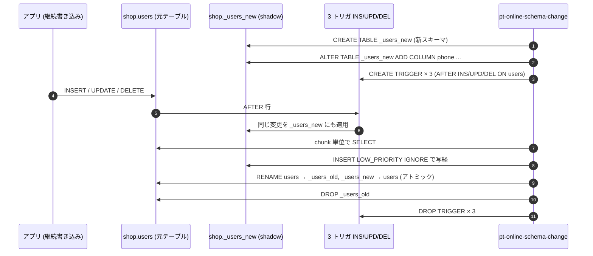

## はじめに

MySQL の運用界隈で **「pt-table-sync で揃える」「pt-online-schema-change で alter する」** という言い回しは、もはやコマンドそのものより「やる事の名前」として通用している。一方で、これらの `pt-*` ツールはサードパーティ製で、内部の挙動 — 例えば「pt-table-sync は replica に直接書かない」「pt-online-schema-change は shadow テーブルとトリガで継続書き込みを吸収する」 — は実際に動かしてみないと腑に落ちにくい。

そこでこの記事では、

- Percona Server 8.0 を **source / replica** の 2 ノードで Docker Compose に立て
- `STATEMENT` フォーマットの binlog で素朴にレプリを張り
- `perconalab/percona-toolkit` イメージから 4 つのツールを順に叩く

という構成で、`pt-table-checksum` / `pt-table-sync` / `pt-online-schema-change` / `pt-query-digest` の実際の出力を見ながら挙動を確かめていく。記事中で出てくるスクリプトは全部 [percona-toolkit-sample](https://github.com/NOGUD626/percona-toolkit-sample) に置いてある。`docker compose up -d` から各 `scripts/*.sh` を順に走らせると、本記事と同じ出力が再現できるはず。

## 構成

```
                                 binlog (STATEMENT)
        ┌──────────────┐ ─────────────────────────▶ ┌──────────────┐
        │ pt-source    │                            │ pt-replica   │
        │ Percona 8.0  │                            │ Percona 8.0  │
        │ server-id=1  │                            │ server-id=2  │
        │ port: 13306  │                            │ port: 13307  │
        └──────┬───────┘                            └──────┬───────┘
               │                                           │
               │ ┌──── docker compose exec ──────────────┐ │
               │ │                                       │ │
               └─┤     pt-toolkit  (Perl + pt-* 群)      ├─┘
                 │     entrypoint: sleep infinity        │
                 └───────────────────────────────────────┘
```

ポイントは 3 点:

- レプリ形式は `STATEMENT`。これは `pt-table-sync --sync-to-source` が要求する前提に合わせている (後述)
- ツール実行用に **DB と分離した** `perconalab/percona-toolkit` を別コンテナで常駐。pt-* は MySQL と同居しなくて良いので、その特性を構成図でも示しておく
- replica には `--report-host=replica` を渡し、source の `SHOW REPLICAS` で発見可能にしている。これは `pt-table-checksum --recursion-method=hosts` で必要

`compose.yaml` の重要箇所だけ:

```yaml
services:
  source:
    image: percona/percona-server:8.0
    command: >
      --server-id=1
      --log-bin=/var/lib/mysql/mysql-bin
      --binlog-format=STATEMENT
      --slow-query-log=ON
      --slow-query-log-file=/var/lib/mysql/slow.log
      --long-query-time=0          # 全クエリ slowlog
  replica:
    image: percona/percona-server:8.0
    command: >
      --server-id=2
      --log-bin=/var/lib/mysql/mysql-bin
      --binlog-format=STATEMENT
      --read-only=ON
      --report-host=replica
      --report-port=3306
  toolkit:
    image: perconalab/percona-toolkit:latest
    entrypoint: ["sleep", "infinity"]
```

binlog / slowlog は **datadir 配下に置く** のがコツ。`/var/log/mysql/` 用に別ボリュームを切ると、所有権 (root vs mysql) で起動失敗してハマる。

## テストデータ

`init/` の SQL で 5 テーブル投入する。再帰 CTE で決定的に生成しているので、何度立て直しても同じ行が並ぶ。

| テーブル | 件数 | 構造 | この記事での役どころ |
|---------|------|------|---------------------|
| `users` | 1,000 | 単一 PK + UNIQUE email | pt-table-sync のメイン舞台、pt-OSC の ALTER 対象 |
| `products` | 200 | 単一 PK + UNIQUE sku | 1 件 UPDATE で 1 チャンク差分を作る |
| `orders` | 3,000 | 単一 PK + index(user_id) | チャンク分割確認 |
| `order_items` | 9,000 | 複合 PK | Nibble アルゴリズム検証 |
| `access_log` | 5,000 | **主キーなし** | GroupBy / Stream の検証 |

ここで一つ落とし穴があった。`02-seed.sql` で連番生成に使う再帰 CTE が **`cte_max_recursion_depth=1000` のデフォルトで死ぬ**。orders (3000) を入れる時点で `ERROR 3636 (HY000): Recursive query aborted after 1001 iterations` が出て、Docker の `docker-entrypoint-initdb.d` はそこで打ち切られ、後続の `03-users.sql` (`repl` / `toolkit` ユーザ作成) が走らないまま起動完了する。表面的には `up -d` も `Healthy` も通っていて、後から `pt-table-checksum` が「`Access denied`」で落ちて初めて気付く類の事故。

防御として SQL の先頭で:

```sql
SET SESSION cte_max_recursion_depth = 100000;
```

を明示する。

## 1. レプリ構築 — ダンプベースの初期コピー

`docker compose up -d` で 2 ノードは立つが、source の init が終わってから replica が起動するため、replica は **source に既に投入されたデータを持っていない**。そこで `mysqldump --source-data=2` で「現在の binlog 位置をコメントに刻んだ論理ダンプ」を取り、それを replica に流し込んでから `CHANGE REPLICATION SOURCE TO` する。

```bash
# scripts/00-setup-replication.sh の核心部分
docker compose exec source mysqldump -uroot -prootpass \
  --source-data=2 --single-transaction --routines --triggers \
  --databases shop > /tmp/source-dump.sql

# ダンプヘッダのコメントから位置を抜き出す
POS_LINE=$(grep -m1 'CHANGE MASTER TO' /tmp/source-dump.sql)
FILE=$(echo "$POS_LINE" | sed -E "s/.*MASTER_LOG_FILE='([^']+)'.*/\1/")
POS=$(echo  "$POS_LINE" | sed -E "s/.*MASTER_LOG_POS=([0-9]+).*/\1/")

# replica にダンプをロード → CHANGE REPLICATION SOURCE TO → START REPLICA
docker compose exec replica mysql < /tmp/source-dump.sql
docker compose exec replica mysql -e "
  CHANGE REPLICATION SOURCE TO
    SOURCE_HOST='source', SOURCE_USER='repl', SOURCE_PASSWORD='replpass',
    SOURCE_LOG_FILE='${FILE}', SOURCE_LOG_POS=${POS},
    GET_SOURCE_PUBLIC_KEY=1;
  START REPLICA;"
```

ここでもう一つの落とし穴。`mysqldump --databases shop` は **`mysql.user` を含まない** ので、replica は `shop` データベースは持つが `repl` / `toolkit` ユーザは持たない。源側で `START REPLICA` した直後に `Last_IO_Error: Access denied for user 'repl'@'172.18.0.3'` が出る。setup スクリプトの末尾で replica にもユーザを別途 CREATE しておく:

```sql
CREATE USER IF NOT EXISTS 'repl'@'%' IDENTIFIED WITH mysql_native_password BY 'replpass';
GRANT REPLICATION SLAVE ON *.* TO 'repl'@'%';
CREATE USER IF NOT EXISTS 'toolkit'@'%' IDENTIFIED WITH mysql_native_password BY 'toolkitpass';
GRANT ALL PRIVILEGES ON *.* TO 'toolkit'@'%';
```

`mysql_native_password` の明示は必須。`perconalab/percona-toolkit` イメージに同梱の Perl DBD::mysql は古めで、MySQL 8.0 デフォルトの `caching_sha2_password` を喋れない。

セットアップ完了時の状態:

```
== replica の状態 ==
              Source_Log_File: mysql-bin.000003
          Read_Source_Log_Pos: 157
           Replica_IO_Running: Yes
          Replica_SQL_Running: Yes
        Seconds_Behind_Source: 0
== source からの SHOW REPLICAS で replica が見えるか確認 (report-host の効果) ==
Server_Id  Host     Port  Source_Id  Replica_UUID
2          replica  3306  1          a8cc66fc-...
```

`report-host` が効いて `Host=replica` が見えている。これが後の `pt-table-checksum --recursion-method=hosts` の動作条件。

## 2. pt-table-checksum — 差分検出

ベースライン取得から。

```bash
docker compose exec toolkit pt-table-checksum \
    h=source,u=toolkit,p=toolkitpass,P=3306 \
    --databases shop \
    --recursion-method=hosts \
    --chunk-size=500 \
    --chunk-size-limit=20 \
    --no-check-binlog-format
```

出力:

```
            TS ERRORS  DIFFS     ROWS  DIFF_ROWS  CHUNKS SKIPPED    TIME TABLE
06-10T14:45:08      0      0     5000          0       1       0   0.313 shop.access_log
06-10T14:45:08      0      0     9000          0       1       0   0.322 shop.order_items
06-10T14:45:08      0      0     3000          0       1       0   0.328 shop.orders
06-10T14:45:09      0      0      200          0       1       0   0.320 shop.products
06-10T14:45:09      0      0     1001          0       1       0   0.323 shop.users
```

`DIFFS=0` で全テーブル差分なし。

`--chunk-size-limit` を **デフォルトの 2.0 のままだと「one chunk で済む筈なのに行が多すぎる」と判定されて Skip される** ことがある。これは pt-table-checksum がチャンクサイズを `EXPLAIN` の rows 推定で決めるためで、推定が 0〜1 行に丸まる小テーブルでも実際に数千行あると「想定外」と見做して逃げる。`--chunk-size-limit=20` のように比率を大きく取ると通る。

ここで replica にだけ差分を入れる。`sql_log_bin=0` で binlog を回避すれば、source からは見えない「片肺だけの変更」になる。

```sql
SET SESSION sql_log_bin = 0;
USE shop;
UPDATE users SET name = 'DRIFTED-USER-0001' WHERE id = 1;
DELETE FROM users WHERE id = 2;
INSERT INTO users (id, email, name) VALUES (99999, 'ghost@replica.local', 'GhostOnReplica');
UPDATE products SET price_jpy = 999999 WHERE id = 10;
```

もう一度 `pt-table-checksum` を回すと:

```
            TS ERRORS  DIFFS     ROWS  DIFF_ROWS  CHUNKS SKIPPED    TIME TABLE
06-10T14:46:13      0      1      200          0       1       0   0.320 shop.products
06-10T14:46:14      0      1     1001          0       1       0   0.323 shop.users
```

`shop.products` と `shop.users` で `DIFFS=1` 。`percona.checksums` テーブルを直接見ると、各チャンクの「source 側 CRC vs replica 側 CRC」が記録されている:

```sql
mysql> SELECT db, tbl, chunk, this_cnt, source_cnt,
       LEFT(this_crc,12) tc, LEFT(source_crc,12) sc
       FROM percona.checksums;
+------+-------------+-------+----------+------------+--------------+--------------+
| db   | tbl         | chunk | this_cnt | source_cnt | tc           | sc           |
+------+-------------+-------+----------+------------+--------------+--------------+
| shop | access_log  |     1 |     5000 |       5000 | 30b56214...  | 30b56214...  |
| shop | orders      |     1 |     3000 |       3000 | 237db476...  | 237db476...  |
| shop | order_items |     1 |     9000 |       9000 | abcb4b6c...  | abcb4b6c...  |
| shop | products    |     1 |      200 |        200 | fd50923e...  | 678597c2...  |  ← 差分
| shop | users       |     1 |     1001 |       1001 | ea365b7a...  | 6d5f81fa...  |  ← 差分
+------+-------------+-------+----------+------------+--------------+--------------+
```

行数は同じだが CRC が違う。これが「内容のズレ」を意味するシグナルになる。

ちなみに `pt-table-checksum` のプロセス終了コードは **「ビットフラグ」** で、差分があると `2` ビットが立つ。SHELL のスクリプトで `set -e` していると差分検出時に **「正常動作だが非ゼロ」** で全体が落ちる。`|| true` で受けるか、`$?` を見て分岐するのが正解。

## 3. pt-table-sync — 修復

差分が分かったので埋める。`pt-table-sync` は 2 つの戦略がある:

- **`--sync-to-source`**: replica を指定する。pt-table-sync は対応する source を探し、**source 側に REPLACE / DELETE / INSERT を発行**。binlog 経由で replica に伝播して結果的に揃う
- **直接書き込み**: source / replica の 2 つの DSN を渡し、片方の内容で片方を上書き。replica に直接書くのでレプリの整合性を壊す。レプリ無しの単発同期向け

レプリ構成では `--sync-to-source` 一択。まずは `--print` で「何が出るか」だけ確認する:

```bash
docker compose exec toolkit pt-table-sync \
    --print \
    --replicate percona.checksums \
    --sync-to-source \
    h=replica,u=toolkit,p=toolkitpass,P=3306
```

出力 (一部):

```sql
REPLACE INTO `shop`.`products`(`id`, `sku`, `name`, `price_jpy`)
  VALUES ('10', 'SKU-00010', 'Product 0010', '1370') /*percona-toolkit ... lock:1 transaction:1 ...*/;

DELETE FROM `shop`.`users` WHERE `id`='99999' LIMIT 1 /*percona-toolkit ...*/;

REPLACE INTO `shop`.`users`(`id`, `email`, `name`, `status`, `created_at`)
  VALUES ('1', 'user0001@example.com', 'User 0001', 'pending', '2026-06-10 14:41:45') /*...*/;

REPLACE INTO `shop`.`users`(`id`, `email`, `name`, `status`, `created_at`)
  VALUES ('2', 'user0002@example.com', 'User 0002', 'deleted', '2026-06-10 14:40:45') /*...*/;
```

- replica にだけあった `id=99999` は `DELETE`
- replica が消した `id=2` は `REPLACE INTO` で復活
- replica が書き換えた `id=1` の `name` は `REPLACE INTO` で上書き
- replica が変えた `products.id=10` の価格も `REPLACE`

`--print` の SQL を見てから `--execute` に切り替える流れは、本番作業の作法としても効く。

```bash
docker compose exec toolkit pt-table-sync \
    --execute --verbose \
    --replicate percona.checksums \
    --sync-to-source \
    h=replica,u=toolkit,p=toolkitpass,P=3306
```

出力:

```
# Syncing via replication P=3306,h=replica,p=...,u=toolkit
# DELETE REPLACE INSERT UPDATE ALGORITHM START    END      EXIT DATABASE.TABLE
#      0       1      0      0 Chunk     14:48:01 14:48:01 2    shop.products
#      1       2      0      0 Chunk     14:48:01 14:48:02 2    shop.users
```

products に REPLACE 1 件、users に DELETE 1 件 + REPLACE 2 件。EXIT カラムが `2` なのは pt-table-checksum と同じビットフラグで「差分があった (= 同期した)」の意。

再度 checksum を回すと:

```
            TS ERRORS  DIFFS     ROWS  DIFF_ROWS  CHUNKS SKIPPED    TIME TABLE
06-10T14:48:02      0      0     5000          0       1       0   0.315 shop.access_log
06-10T14:48:03      0      0     9000          0       1       0   0.333 shop.order_items
06-10T14:48:03      0      0     3000          0       1       0   0.327 shop.orders
06-10T14:48:03      0      0      200          0       1       0   0.320 shop.products
06-10T14:48:04      0      0     1001          0       1       0   0.323 shop.users
```

全テーブル `DIFFS=0` に戻った。

## 4. pt-online-schema-change — 無停止 ALTER

`users` テーブルに `phone VARCHAR(20)` を追加してみる。同時並行で 20 回 INSERT を流して **「ALTER 中に書き込みが落ちないか」** を確認する。

```bash
# 裏で 0.5 秒間隔の INSERT を 20 回
(
  for i in $(seq 1 20); do
    docker compose exec -T source mysql -uroot -prootpass \
      -e "INSERT INTO shop.users (email, name) VALUES ('osc-$i@example.com','OSC user $i');"
    sleep 0.5
  done
) &

# 本命
docker compose exec toolkit pt-online-schema-change \
    --execute \
    --alter "ADD COLUMN phone VARCHAR(20) NULL" \
    --no-check-replication-filters \
    --recursion-method=hosts \
    --print \
    h=source,u=toolkit,p=toolkitpass,P=3306,D=shop,t=users
```

`--print` を付けるとツールが裏でやっている事が全部標準出力に出る。要約するとこういう順序:



トリガが面白い。例えば AFTER INSERT のトリガは:

```sql
CREATE TRIGGER `pt_osc_shop_users_ins` AFTER INSERT ON `shop`.`users`
FOR EACH ROW
BEGIN
  DECLARE CONTINUE HANDLER FOR 1146 begin end;
  REPLACE INTO `shop`.`_users_new` (`id`, `email`, `name`, `status`, `created_at`)
    VALUES (NEW.`id`, NEW.`email`, NEW.`name`, NEW.`status`, NEW.`created_at`);
END
```

- `REPLACE INTO` を使うので、写経中の chunk と新規 INSERT が衝突しても勝てる側が決まる
- `CONTINUE HANDLER FOR 1146` (Table doesn't exist) は、`RENAME` の瞬間に shadow テーブルが消える 0.x ms に対する保険

写経完了後の `RENAME TABLE users TO _users_old, _users_new TO users` は **1 ステートメントでアトミック**。クライアントから見ると次のクエリでカラムが増えているだけで、テーブル名は何も変わらない。

実行ログ:

```
Created new table shop._users_new OK.
Altered `shop`.`_users_new` OK.
Creating triggers...
Created triggers OK.
Copying approximately 1001 rows...
Copied rows OK.
Swapping tables...
RENAME TABLE `shop`.`users` TO `shop`.`_users_old`, `shop`.`_users_new` TO `shop`.`users`
Swapped original and new tables OK.
Dropping old table...
Dropped old table `shop`.`_users_old` OK.
Dropping triggers...
Dropped triggers OK.
Successfully altered `shop`.`users`.
```

ALTER 後のスキーマ:

```
Field      Type                                Null Key Default Extra
id         int unsigned                        NO   PRI NULL    auto_increment
email      varchar(128)                        NO   UNI NULL
name       varchar(64)                         NO       NULL
status     enum('active','pending','deleted')  NO       active
created_at datetime                            NO       CURRENT_TIMESTAMP
phone      varchar(20)                         YES      NULL              ← 追加された
```

裏で打った 20 件の INSERT:

```
mysql> SELECT COUNT(*) FROM shop.users WHERE email LIKE 'osc-%';
+-------+
| count |
+-------+
|    20 |   ← source
+-------+
|    20 |   ← replica にも全部伝播
+-------+
```

無停止 ALTER と、その間の書き込みが両ノードに残っている事が確認できた。

## 5. pt-query-digest — slowlog 集計

`compose.yaml` で `long_query_time=0` を指定しているので、**source が受けたすべてのクエリが slowlog に流れている**。`pt-query-digest` でそれを集計する。

意図的に重めのワークロードを焚いてから:

```bash
# 軽い SELECT 200 回
for i in $(seq 1 200); do
  mysql -e "SELECT COUNT(*) FROM shop.users WHERE status='active';"
done

# JOIN + GROUP BY 30 回
for i in $(seq 1 30); do
  mysql -e "SELECT u.id, u.name, COUNT(o.id) AS orders_cnt
            FROM shop.users u LEFT JOIN shop.orders o ON o.user_id=u.id
            GROUP BY u.id, u.name ORDER BY orders_cnt DESC LIMIT 10;"
done

# 全件 LIKE で full scan な遅いやつ 5 回
for i in $(seq 1 5); do
  mysql -e "SELECT COUNT(*) FROM shop.access_log WHERE path LIKE '%items%';"
done

# slowlog を toolkit コンテナへコピーして集計
docker cp pt-source:/var/lib/mysql/slow.log /tmp/slow.log
docker cp /tmp/slow.log pt-toolkit:/tmp/slow.log
docker compose exec toolkit pt-query-digest --limit 3 /tmp/slow.log
```

`pt-query-digest` の出力は 3 つのブロックで構成される:

1. **Overall** — 集計全体のサマリ。クエリ総数、Exec time / Lock time / Rows sent / Rows examine の合計と分布
2. **Query distribution** — クエリを「同じ抽象形」でグルーピングして、Response time 合計の TOP N を一覧表で出す
3. **Detailed report** — 各 TOP クエリの個別レポート: フィンガープリント (パラメータを `?` 化したテンプレ)、Query_time 分布、サンプル SQL、`EXPLAIN` ヒント

実出力の Overall / Profile 抜粋:

```
# Overall: 13.72k total, 215 unique, 10.09 QPS, 0.00x concurrency
# Exec time             2s     1us    27ms   143us   445us   721us    13us
# Rows examine      22.25M       0 199.41k   1.66k 1012.63  13.91k       0

# Profile
# Rank Query ID                            Response time Calls R/Call V/M
# ==== =================================== ============= ===== ====== ====
#    1 0xE77769C62EF669AA7DD5F6760F2D2EBB   0.2349 12.0%   467 0.0005  0.00 SHOW VARIABLES
#    2 0x65EACCB81E5CE21F99E369F100E2BE04   0.1933  9.8%   480 0.0004  0.00 SELECT shop.users
#    3 0x7DFA2D5D9DBC803F79DB97773EC5447B   0.1732  8.8%  1705 0.0001  0.00 INSERT time_zone_transition
# MISC 0xMISC                               1.3618 69.4% 11072 0.0001   0.0 <212 ITEMS>
```

`long_query_time=0` を起動時から付けっぱなしにすると、テスト用に流した `SELECT COUNT(*) FROM shop.users` (Rank 2: 480 calls) と並んで、

- Rank 1: `SHOW VARIABLES LIKE 'character_set_server'` (pt-toolkit が裏で叩いている設定確認)
- Rank 3: `INSERT INTO time_zone_transition` (Percona Server 起動時の tzinfo 投入)

など、**運用ノイズに当たるクエリ** が普通に上位に来る。これが「pt-query-digest の出力は時刻範囲を絞って読む物」という運用作法の根拠で、本番では `FLUSH LOGS` で slowlog を切ってから測りたい期間だけ集計するのが定石になる。

Rank 2 の `SELECT COUNT(*) FROM shop.users WHERE status='active'` を Detail で開くと:

```
# Query 2: 0.58 QPS, 0.00x concurrency
# Count          3     480       ← この種類のクエリ 480 件、全体の 3%
# Exec time      9   193ms       ← 合計 193ms、全体の 9%
# Rows examine   2 478.59k       ← 1 件あたり 1021 行スキャン × 480 = 480k 行
# Tables
#    SHOW TABLE STATUS FROM `shop` LIKE 'users'\G
#    SHOW CREATE TABLE `shop`.`users`\G
# EXPLAIN /*!50100 PARTITIONS*/
SELECT COUNT(*) FROM shop.users WHERE status='active'\G
```

- フィンガープリント (パラメータ `?` 化された抽象形) ではなく **実際に発行された具体 SQL** をサンプルで出す
- `EXPLAIN` 用のクエリと `SHOW TABLE STATUS` / `SHOW CREATE TABLE` をご丁寧に整形済みで添える
- `Query_time distribution` で µs 〜 ms のレンジを文字ヒストグラムで描画 (`100us` の所に `#` が並んでいる)

pt-query-digest はこの他にも、

- `--filter='$event->{db} eq "shop"'` のように Perl 式で絞り込み
- `--review h=...,t=...` で「過去に見たクエリ」のテーブルに記録して差分管理
- `--type tcpdump` でパケットキャプチャを集計

など多機能。一旦は **「`long_query_time=0` で全クエリ撮って → 集計」** という最低限の流れだけ手に覚えさせる。

## まとめ

| ツール | 何をした |
|--------|----------|
| pt-table-checksum | チャンク単位 MD5 で差分検出。replica に差分注入 → CRC のズレを `percona.checksums` で観察 |
| pt-table-sync | `--sync-to-source` で「source 経由で binlog 伝播」させ、replica を勝手に書き換えない方針で修復 |
| pt-online-schema-change | shadow テーブル + INS/UPD/DEL の 3 トリガ + アトミック RENAME で、書き込みを止めずに `phone` カラムを追加 |
| pt-query-digest | `long_query_time=0` で全クエリ slowlog → コール数 / 合計時間 / サンプル SQL を抜き出し |

実装に踏み込むと、4 つのツールは **「pt-table-sync の `--sync-to-source` だけ STATEMENT 必須、他はそうでもない」** とか **「pt-online-schema-change のトリガは `REPLACE` を使うことで chunk コピーと並走書き込みの順序を気にしない」** など、それぞれ独立した小さな設計判断の集合体になっている。Docker で 1 セット立ててから個別に叩くと、その判断の理由が割と素直に見える。

書き捨ての検証用に作った compose / scripts は [percona-toolkit-sample](https://github.com/NOGUD626/percona-toolkit-sample) に置いてある。手元で `docker compose up -d && bash scripts/00-setup-replication.sh` で同じ状態が立つはず。
