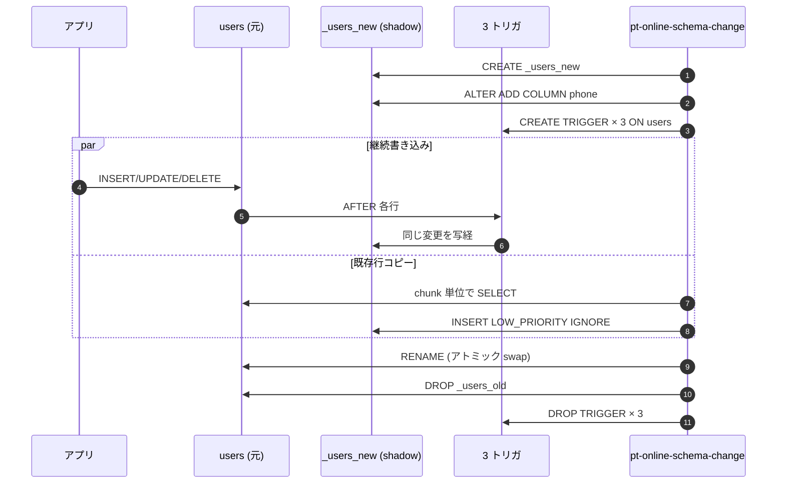

# pt-online-schema-change — 無停止 ALTER

## 概念

元テーブルに直接 `ALTER TABLE` をかけずに、

1. 新スキーマで shadow テーブル `_<table>_new` を作る
2. 元テーブルに INS/UPD/DEL の 3 トリガを付け、新規書き込みを shadow にも流す
3. 既存行を chunk 単位で shadow にコピー
4. `RENAME TABLE` でアトミック swap (`users → _users_old, _users_new → users`)
5. `_users_old` を DROP、トリガを DROP

という流れで、**書き込みを止めない ALTER** を実現する。



## このリポジトリで使ったコマンド

```bash
docker compose exec toolkit pt-online-schema-change \
    --execute \
    --alter "ADD COLUMN phone VARCHAR(20) NULL" \
    --no-check-replication-filters \
    --recursion-method=hosts \
    --print \
    h=source,u=toolkit,p=toolkitpass,P=3306,D=shop,t=users
```

| オプション | 意味 |
|-----------|------|
| `--alter "..."` | ALTER TABLE の内容を文字列で渡す |
| `--execute` | 実際に変更を実行 (`--dry-run` で安全モード) |
| `--no-check-replication-filters` | filter 設定の確認をスキップ (検証環境用) |
| `--print` | 内部で発行している SQL を全部 stdout に出す |
| `D=shop,t=users` | DSN の DB / Table 指定 |

## ツールが付ける 3 トリガ (`--print` で出てくる実物)

INSERT トリガ:

```sql
CREATE TRIGGER `pt_osc_shop_users_ins` AFTER INSERT ON `shop`.`users`
FOR EACH ROW
BEGIN
  DECLARE CONTINUE HANDLER FOR 1146 begin end;
  REPLACE INTO `shop`.`_users_new` (`id`, `email`, `name`, `status`, `created_at`)
    VALUES (NEW.`id`, NEW.`email`, NEW.`name`, NEW.`status`, NEW.`created_at`);
END
```

UPDATE トリガ:

```sql
CREATE TRIGGER `pt_osc_shop_users_upd` AFTER UPDATE ON `shop`.`users`
FOR EACH ROW
BEGIN
  DECLARE CONTINUE HANDLER FOR 1146 begin end;
  DELETE IGNORE FROM `shop`.`_users_new`
    WHERE !(OLD.`id` <=> NEW.`id`) AND `shop`.`_users_new`.`id` <=> OLD.`id`;
  REPLACE INTO `shop`.`_users_new` (`id`, `email`, `name`, `status`, `created_at`)
    VALUES (NEW.`id`, NEW.`email`, NEW.`name`, NEW.`status`, NEW.`created_at`);
END
```

DELETE トリガ:

```sql
CREATE TRIGGER `pt_osc_shop_users_del` AFTER DELETE ON `shop`.`users`
FOR EACH ROW
BEGIN
  DECLARE CONTINUE HANDLER FOR 1146 begin end;
  DELETE IGNORE FROM `shop`.`_users_new` WHERE `shop`.`_users_new`.`id` <=> OLD.`id`;
END
```

**ポイント**:

- `REPLACE INTO` を使うので、shadow コピー中に同じ PK が衝突しても新しい行で上書きされる (= 並走の順序を気にしなくていい)
- `CONTINUE HANDLER FOR 1146 begin end;` は「Table doesn't exist」エラーの保険。RENAME の 0.x ms の間に shadow テーブルが瞬間的に「存在しない」状態になっても黙ってスルー
- `<=>` は NULL-safe equal。`id` が NULL でも比較が成立する

## 実行ログ

```
Created new table shop._users_new OK.
Altered `shop`.`_users_new` OK.
Creating triggers...
Created triggers OK.
Copying approximately 1001 rows...
INSERT LOW_PRIORITY IGNORE INTO `shop`.`_users_new` ... SELECT ... FROM `shop`.`users` LOCK IN SHARE MODE
Copied rows OK.
Analyzing new table...
Swapping tables...
RENAME TABLE `shop`.`users` TO `shop`.`_users_old`, `shop`.`_users_new` TO `shop`.`users`
Swapped original and new tables OK.
Dropping old table...
Dropped old table `shop`.`_users_old` OK.
Dropping triggers...
Dropped triggers OK.
Successfully altered `shop`.`users`.
```

## 無停止の確認

ALTER と並行して `INSERT` を 20 回流したテストでは、ALTER 後に source / replica の両方に 20 件全部残っていた。

```
mysql> SELECT COUNT(*) FROM shop.users WHERE email LIKE 'osc-%';
20  -- source
20  -- replica
```

## ハマりどころ

- **外部キー**: 子テーブルが元テーブルを参照していると、RENAME 後に元テーブル名が `_users_old` に変わり外部キーが切れる。`--alter-foreign-keys-method` で挙動を選ぶ
- **トリガが既にある**: pt-OSC が自前のトリガを乗せる前に元テーブルに既存トリガがあると衝突する
- **長時間 ALTER**: chunk コピー中はずっとトリガが乗っているので、TPS が高い環境ではトリガオーバーヘッドの分だけアプリのレスポンスが少し悪化する
